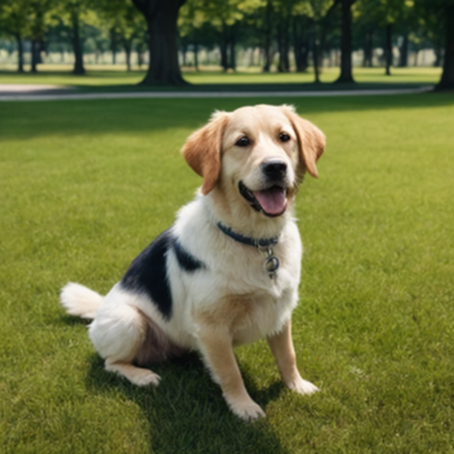

# SD Webui Hires. Fix img2img
This is an Extension for the [Automatic1111 Webui](https://github.com/AUTOMATIC1111/stable-diffusion-webui), which allows you to resize your input image with an Upscaler, before sending it into **img2img**.

> Compatible with [Forge](https://github.com/lllyasviel/stable-diffusion-webui-forge)

By default, the Webui uses the `LANCZOS` algorithm to resize when the generation dimension is different from the size of your input image. You can also set the `Upscaler for img2img` option in the Settings to use an Upscaler instead. Alternatively, you can also send the image to the **Extras** tab and upscale first, then send the result back to the **img2img** tab. This Extension just simplifies the processes.

<table>
<thead align="center">
    <tr>
        <td><b>Extension</b></td>
        <td>Off</td>
        <td>On</td>
    </tr>
</thead>
<tbody align="center">
    <tr>
        <td><b>Result</b></td>
        <td></td>
        <td></td>
    </tr>
</tbody>
</table>

Infotext

1. Generate `a photo of a dog` in `512x512`
2. Resize to `256x256` via **Paint 3D**
3. Upscale to `1024x1024` via **img2img**, with the Extension disabled and enabled respectively
    - **Upscaler:** `4xNomos8kDAT`
4. Resize to `512x512` via **PIL** to save space

